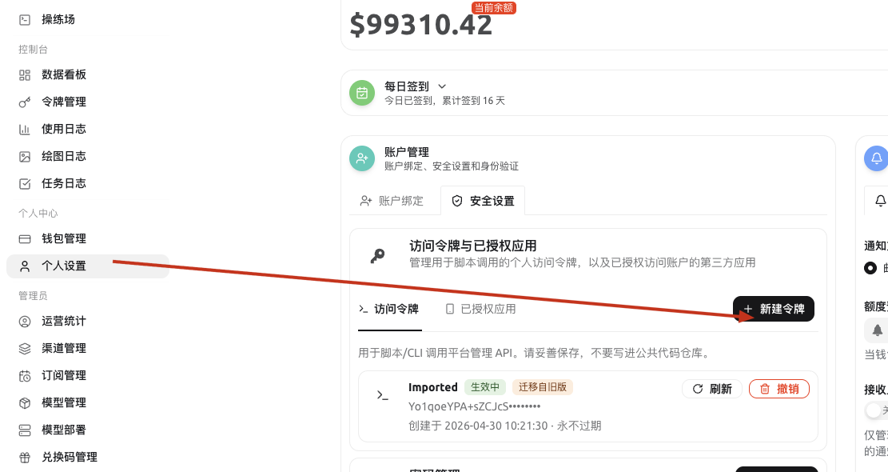

# Auto Scripts

Daily AMUX check-in through GitHub Actions.

## Schedule

The workflow runs at `22:00 UTC`, which is `06:00 Asia/Shanghai`.

GitHub scheduled workflows can be delayed by platform load, so this is the closest GitHub Actions can get to a 06:00 run.

## GitHub setup

1. Push this repository to GitHub.
2. Open the repository on GitHub.
3. Go to `Settings` -> `Secrets and variables` -> `Actions` -> `New repository secret`.
4. Add these secrets:
   - `AMUX_USER_ID`: your own AMUX user id.
   - `AMUX_ACCESS_TOKEN`: your AMUX access token, without the `Bearer ` prefix.
5. Open `Actions` -> `AMUX Check-in` -> `Run workflow` to test it once manually.

## Getting the access token

Do not commit the token and do not paste it into chat.

In AMUX, open `Personal Settings` -> `Security Settings` -> `Access Tokens`, then click `New Token`.

Save only the token value to the GitHub secret `AMUX_ACCESS_TOKEN`.
